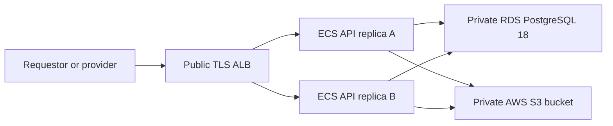

# MutualGPU AWS infrastructure provisioning

Status: current
Date: 2026-07-28

The checked-in CloudFormation templates provision MutualGPU as a multi-replica
ECS service backed by private Amazon RDS for PostgreSQL and AWS S3 artifact
storage.

## Architecture



PostgreSQL is authoritative for structured state and indexed queries. S3 holds
only input/output bytes. ECS live connections and advisory progress remain
process-local; durable assignment, receipt, completion, and notification state
is in PostgreSQL.

## Foundation stack

`deploy/aws/foundation.yaml` provisions:

- one VPC and two public ALB/ECS subnets;
- two private database subnets and an RDS subnet group;
- an API security group that accepts only ALB traffic;
- a database security group that accepts PostgreSQL only from the API security
  group;
- Amazon RDS for PostgreSQL 18 with encrypted `gp3` storage, forced TLS,
  seven-day point-in-time recovery, automated backups, deletion protection,
  snapshots on replacement/deletion, and Performance Insights;
- a generated `mutualgpu/postgres` database secret;
- the ECR repository, ECS cluster, log group, and task roles; and
- an S3 task policy limited to list/CORS plus object access under
  `inputs/*` and `results/*`.

RDS is not publicly reachable. The database endpoint, port, name, and secret
ARN are exported for the service stack.

## Service stack

`deploy/aws/service.yaml` provisions:

- an internet-facing ALB with HTTP-to-HTTPS redirect;
- TLS web/WebSocket/SSE and gRPC routing;
- WAF rate limiting for anonymous provider enrollment;
- an ECS Fargate task definition with separate HTTP/1.1 and HTTP/2 ports;
- PostgreSQL host, port, database, TLS, and bounded-pool settings;
- database password and task-handle encryption key secret injection;
- deterministic AWS S3 artifact-storage configuration; and
- two ECS replicas with a 100/200 rolling deployment and circuit-breaker
  rollback.

The task role does not have access to legacy structured prefixes or a separate
provider-key bucket.

## Required deployment secret

The Secrets Manager JSON document named `mutualgpu/deployment` must include:

```json
{
  "adminMasterPassword": "...",
  "taskHandleEncryptionKey": "base64-encoded-32-byte-key"
}
```

Never place either value in source control, image layers, shell history, build
output, or logs. The RDS password is generated separately by the foundation
stack.

## Deploy

Every MutualGPU AWS CLI/control-plane operation must use `--profile ai-quinn`.
The deployment wrapper enforces that profile:

```bash
AWS_REGION=us-east-1 scripts/deploy-aws-service.sh <immutable-image-tag>
```

The wrapper:

1. resolves the account, ECR digest, issued certificate, deployment secret, and
   current stacks with `--profile ai-quinn`;
2. validates the service template;
3. deploys an immutable image digest; and
4. returns the public HTTPS endpoint.

Before deploying the foundation, confirm that this identity is authorized for
the RDS actions required by CloudFormation, including engine-version
inspection, instance/subnet/parameter-group creation, tagging, snapshots, and
deletion protection. Template validation alone does not grant those
permissions.

Do not infer live bucket or service targets from an old adapter or document.
For diagnostics, resolve them from current CloudFormation outputs/parameters
and the active ECS task definition.

## Database deployment and readiness

Embedded migrations are ordered and checksummed. Each API instance takes the
same PostgreSQL advisory migration lock, so a rolling multi-replica deployment
cannot apply a migration concurrently. A changed checksum is a startup error.

Readiness remains false until:

- the expected migration set exists;
- PostgreSQL accepts a query;
- S3 accepts a bounded health request; and
- startup recovery has reconciled pre-start active attempts.

The service uses `READ COMMITTED`, explicit aggregate versions, compare-and-swap
updates, constraints, and an outbox. It does not use `xmin` or process-local
locks for production correctness.

## Cutover and rollback

Follow the write-pause procedure in
[MutualGPU publishing and cutover preparation](09-mutualgpu-publishing-and-preparation.md).
The importer resolves AWS resources using `--profile ai-quinn`, reads legacy
structured S3 data, and writes PostgreSQL through a resumable ledger.

Rollback is not a connection-string toggle:

1. pause mutations and assignments;
2. preserve an RDS snapshot;
3. assess post-cutover PostgreSQL changes;
4. correct forward or export through an explicitly reviewed rollback tool; and
5. reopen writes only after one structured store is authoritative.

Do not delete legacy structured objects during cutover. Retention cleanup
requires separate authorization.

## Operational checks

Monitor:

- database connection-pool saturation and transaction latency;
- optimistic concurrency conflicts;
- queue depth and assignment collisions;
- outbox oldest age, attempts, and failures;
- authorized/uploading/uploaded operation age;
- orphan input/output collection counts;
- task status distributions against the cutover baseline; and
- ECS, RDS, and S3 readiness.

Never log authorization headers, provider keys, task handles, upload tokens,
receipts, database passwords, secret values, or presigned URL query strings.
