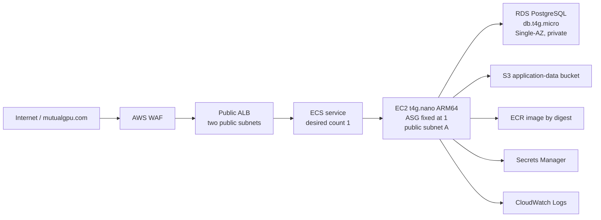

# MutualGPU migration handoff: Quinn-MutualCompute

- Status: Phase 0 verification and Phase 1 local implementation complete; no cloud mutations
- Prepared: 2026-07-30
- Repository branch: `alpha`
- Repository commit at planning time: `f1042bb04aa6ccc13c68eb21b6aa36640cd7efc3` (`postgres cutover`)
- Target AWS account: Quinn-MutualCompute, `428590861908`
- Target AWS region: `us-east-1`

## Purpose

This is the self-contained handoff for moving the live MutualGPU application into
the new Quinn-MutualCompute AWS account. A new Codex context should read this
document and `AGENTS.md` before doing any work.

The intended result is:

- the existing MutualGPU application behavior and public hostname with a clean,
  empty target data plane;
- one ECS service task on one ARM64 EC2 `t4g.nano`, not Fargate;
- one Single-AZ RDS PostgreSQL `db.t4g.micro`;
- the existing ALB and focused WAF protection retained;
- no NAT gateway;
- a target-only immutable Linux AMD64 plus Linux ARM64 rebuild of the exact
  S3-exclusive application release observed live in `ai-quinn`;
- low-effort, low-risk cost reductions without redesigning the application.

No database, S3 object, provider identity, task, partner approval, or other
application-state migration is planned. The target starts clean. The `ai-quinn`
source account is strictly read-only and is limited to the already-completed
minimum discovery of the deployed image and non-secret runtime configuration.

This document is a plan, not authorization to skip review. Before any target
mutation, the next context must resolve the significant identifiers listed below,
show the exact proposed configuration or CloudFormation change set, and get the
user's confirmation.

## Current state

### Completed in this session

- Created the target IAM user `mutual-ai-automation`.
- Configured console access and MFA for that user.
- Attached AWS managed policy `SignInLocalDevelopmentAccess`.
- Added inline policy `AssumeMutualGPUMigrationAdmin`, limited to assuming:
  `arn:aws:iam::428590861908:role/MutualGPUMigrationAdmin`.
- Created `MutualGPUMigrationAdmin`, trusted only by:
  `arn:aws:iam::428590861908:user/mutual-ai-automation`.
- Attached `AdministratorAccess` to the migration role.
- Set the role's maximum session duration to 12 hours.
- Configured the CLI profiles described below.
- Verified the target CLI identity returned:
  `arn:aws:sts::428590861908:assumed-role/MutualGPUMigrationAdmin/mutual-ai-automation`.
- Updated `AGENTS.md` locally with source/target account boundaries. That edit is
  not committed.

No long-lived access key was created during this setup.

### Not completed

- No MutualGPU application infrastructure has been created in the target account.
- No target CloudFormation stack exists.
- No target ACM certificate exists.
- No target S3 bucket, ECR image, ECS service, EC2 instance, ALB, WAF, RDS database,
  or application secret has been created.
- The exact source image was resolved read-only and recorded in
  `docs/mutualgpu-quinn-mutualcompute-deployment-record.md`; it has no ARM64 child.
- The live source uses the legacy structured-S3 model, but no source data is
  needed or permitted for the approved clean-start scope.
- No image or application data has been copied.
- No DNS record has been changed.
- No source application resource has been modified or stopped.
- Phase 1 migration code and CloudFormation changes are implemented locally and
  have not been applied to AWS.

Read-only target checks during this session found no CloudFormation stacks or ACM
certificates. They also confirmed that an ARM64 ECS-optimized Amazon Linux 2023
AMI parameter was available and that PostgreSQL 18.4 on `db.t4g.micro` was
orderable in `us-east-1`. These are time-sensitive facts and must be rechecked
before provisioning.

### Working tree

At handoff creation time, the pre-existing local change was:

```text
 M AGENTS.md
```

This handoff document will additionally be untracked until it is deliberately
staged or committed. Preserve the user's unrelated changes if more appear.

## AWS identity and browser boundaries

Use explicit profiles on every AWS CLI command. Never rely on a default profile.

| Purpose | Profile or identity | Required behavior |
|---|---|---|
| Source discovery | `ai-quinn` | Strictly read-only; minimum descriptive reads only |
| Target authentication | `quinn-mutualcompute-login` | Authentication only; never use for service operations |
| Target operations | `quinn-mutualcompute` | Must resolve to account `428590861908` in `us-east-1` |
| Target console user | `mutual-ai-automation` | MFA-protected console identity |
| Target role | `MutualGPUMigrationAdmin` | Temporary broad migration/management authority |

The target login profile must be bound exactly to:

```text
arn:aws:iam::428590861908:user/mutual-ai-automation
```

After every `aws login`, verify that binding locally before making a service call:

```bash
aws configure get profile.quinn-mutualcompute-login.login_session
```

Before every batch of target mutations, run an identity gate and compare both
fields literally:

```bash
aws sts get-caller-identity \
  --profile quinn-mutualcompute \
  --query '{Account:Account,Arn:Arn}' \
  --output json
```

Expected result:

```text
Account: 428590861908
Arn: arn:aws:sts::428590861908:assumed-role/MutualGPUMigrationAdmin/mutual-ai-automation
```

If the login binding, account, role, or session name differs, stop and ask the
user to verify the profile. Do not accept “same account” with a different
principal as equivalent.

Before any further source discovery, resolve the `ai-quinn` caller identity and
explicitly distinguish it from the target. Do not copy an account ID from
documentation into an AWS command without first verifying it, and never issue a
source mutation under this plan.

Brave currently has unusually broad console authority. Prefer reviewed CLI and
CloudFormation operations. When MFA, ACM DNS validation, DNS management, or
another console-only interaction is needed:

1. pause and tag the user;
2. use Brave only after the user is present;
3. visibly verify account `428590861908` before a target action;
4. verify the exact resource identifier and configuration with the user;
5. avoid unrelated tabs, resources, and settings.

Do not display or log passwords, MFA seeds, secret values, session tokens,
provider passcodes, or raw provider keys. Console MFA is configured, but the next
context should verify the role trust policy before claiming that role assumption
is itself conditioned on MFA.

The AdministratorAccess attachment is intentionally broad for migration. After
stabilization, propose a separate reviewed least-privilege policy for ongoing
automation. Do not reduce or replace access during the migration without approval.

## Confirmed decisions

| Area | Confirmed decision |
|---|---|
| Target account | Quinn-MutualCompute, `428590861908` |
| Region | `us-east-1` |
| ECS compute | EC2-backed ECS capacity provider on one `t4g.nano` |
| RDS compute | `db.t4g.micro`; this is the only planned `t4g.micro` |
| Architecture | Linux ARM64 |
| ECS desired count | 1 |
| Availability | Single task, Single-AZ compute, and Single-AZ database are acceptable |
| First image | Rebuild commit `f96854d9429b398421fe15bbce89a8a741e1c769` under tag `cors-all-origins-20260727-r2` as an immutable Linux AMD64 plus Linux ARM64 index |
| Release retention | Keep at most the last five successful target ECS task-definition revisions and their corresponding target ECR release indexes |
| Ingress | Retain ALB and WAF for TLS and safety controls |
| Scaling | No replica requirement and no application autoscaling |
| Cost goal | Low-hanging cost optimization; avoid elaborate redesign |
| NAT | Do not add a NAT gateway |
| Identity Center | Do not enable AWS Organizations/IAM Identity Center merely for this migration |
| Storage | AWS S3 only; never use Backblaze/B2 |
| Application data | Clean start; do not migrate source PostgreSQL or S3 state |
| Change control | Review the plan and significant configuration before actual changes |

Do not confuse the two instance choices:

- ECS host: `t4g.nano`.
- RDS database: `db.t4g.micro`.

`t4g.micro` is only a possible ECS fallback if the application cannot run safely
on a nano. A fallback is not automatic and requires user approval.

## Blocking confirmations

Resolve and present these as one verification sheet before the first
infrastructure mutation:

1. Whether the public hostname remains exactly `mutualgpu.com`.
2. Confirm that the user will perform certificate-validation and application
   DNS changes manually from the exact values presented after ACM/ALB creation.
3. The exact globally unique target S3 bucket name. Recommended:
   `mutualgpu-data-428590861908-us-east-1`.
4. The target primary and secondary Availability Zones, chosen only after
   rechecking EC2 and RDS availability in the target account. They must be
   distinct. Do not assume that `us-east-1a` is the desired primary.
5. The exact source ECS cluster, service, task definition, image URI, image index
   digest, and non-secret runtime configuration resolved from live resources.
6. Whether to preserve or rotate `adminMasterPassword`; no other source
   application secret needs migration for a clean start.
7. Whether brief cutover downtime and stop-before-start ECS deployments are
   acceptable.
8. Whether RDS storage should be fixed at 20 GiB or allowed to autoscale. The
   cost-minimal recommendation is a fixed 20 GiB with low-storage monitoring.
9. Whether the current WAF enrollment rate remains 10 requests per source IP per
    minute.
10. How long the intact source environment should be retained after cutover.
11. Whether to retain the current target resource-name defaults:
    - foundation stack `mutualgpu-foundation`;
    - service stack `mutualgpu-service`;
    - ECS cluster `mutualgpu-demo`;
    - ECS service and ECR repository `mutualgpu-api`;
    - RDS identifier `mutualgpu-postgres`;
    - log group `/ecs/mutualgpu-api`;
    - secrets `mutualgpu/postgres` and `mutualgpu/deployment`.
12. The exact tag vocabulary below, especially `Owner` and `Environment`.
13. Confirm that the source service remains untouched and that DNS propagation
    can temporarily send traffic to both independent environments. No late
    source writes will be migrated.
14. The rollback policy for writes accepted by the clean target: explicitly
    accept their loss on rollback or separately expand scope later.
15. The budget/anomaly-alert threshold and recipient address, after current
    no-additional-cost monitoring options are verified.
16. The target VPC CIDR after comparing it with the live source and any likely
    future peering networks.

Record the approved values in this document or a separate checked-in deployment
record. Use exact ARNs, IDs, names, and digests rather than descriptions such as
“the new account” or “latest.”

## Tagging and resource ownership

Every taggable resource must identify both what application it serves and how it
is actually managed. Use these proposed base tags consistently after user
confirmation:

| Tag key | Persistent application value | Purpose |
|---|---|---|
| `Application` | `MutualGPU` | Unambiguous application ownership |
| `Project` | `MutualGPU` | Compatibility with the repository's existing tags |
| `Environment` | `Production` | Separates production from disposable validation resources |
| `ManagedBy` | `CloudFormation` for stack resources | Identifies the truthful authoritative management mechanism |
| `Owner` | `Quinn-MutualCompute` | Human/organizational ownership |
| `Component` | Resource-specific | `Network`, `Ingress`, `Compute`, `Database`, `Storage`, `Observability`, `Identity`, or `Migration` |
| `Lifecycle` | `Persistent` | Distinguishes retained application resources from temporary migration resources |

Continue using a resource-specific `Name` tag where it improves console
navigation. Tag keys and values are case-sensitive; do not introduce variants
such as `app`, `App`, or `managed_by`.

Apply these tags with `ManagedBy=CloudFormation` at CloudFormation stack
deployment and explicitly on resource types that do not inherit stack tags
reliably. In particular:

- set ASG tags to propagate at launch;
- use launch-template tag specifications for EC2 instances, EBS volumes, and
  network interfaces;
- enable ECS managed tags and propagate service tags to tasks;
- keep `CopyTagsToSnapshot: true` for RDS;
- explicitly tag the CloudFormation-managed S3 bucket, ECR repository, log group,
  database secret, ALB, target groups, WAF, IAM roles, security groups, subnets,
  route tables, gateway, VPC endpoint, ECS cluster, capacity provider where
  supported, and RDS resources.

CloudFormation's reserved `aws:cloudformation:*` tags complement this strategy
but do not replace `Application` or `ManagedBy`.

Resources created manually outside CloudFormation must use a truthful
`ManagedBy` value:

- the existing automation IAM user should use `ManagedBy=ManualBootstrap`,
  `Application=MutualGPU`, `Component=Identity`, and `Lifecycle=Persistent`
  after a reviewed tagging change;
- the broad `MutualGPUMigrationAdmin` role should use
  `ManagedBy=ManualBootstrap`, `Application=MutualGPU`,
  `Component=Identity`, `Lifecycle=Temporary`, and a fresh `ReviewAfter` date.
  Never auto-delete it; replace it with approved least privilege before removal;
- a manually requested ACM certificate and manually populated deployment secret
  should use `ManagedBy=ManualBootstrap`, `Application=MutualGPU`, their correct
  component, and `Lifecycle=Persistent`;
- one-off canary or diagnostic resources should use
  `ManagedBy=MigrationRunbook`, `Application=MutualGPU`,
  `Environment=Migration`, `Component=Migration`,
  `Lifecycle=Temporary`, and a fresh ISO-8601 `DeleteAfter` date;
- record non-AWS DNS resources in the deployment record with their provider and
  management method because AWS tags cannot cover them.

Inventory temporary resources by tag at the end of every provisioning/cutover
phase and
again during stabilization. Never use an expired date copied from this document.

After the tags exist, offer to activate `Application`, `Environment`, and
`Component` as user-defined cost-allocation tags in the Billing console. That is
a separate billing configuration requiring user verification; it should not
create AWS Organizations or IAM Identity Center.

## Target architecture



### Network layout

Retain the current `10.42.0.0/16` VPC layout unless the user identifies a CIDR
conflict:

- public subnet A: `10.42.0.0/20`;
- public subnet B: `10.42.16.0/20`;
- database subnet A: `10.42.32.0/20`;
- database subnet B: `10.42.48.0/20`.

Resolve the live source VPC CIDR before approving this target CIDR. If both use
`10.42.0.0/16`, direct VPC peering is impossible. Overlap is acceptable for this
clean start because no source-to-target data path or peering is planned. If future
peering is likely, choose a non-overlapping target CIDR before creating the VPC;
changing it later is disruptive.

The ALB must attach to two subnets in two Availability Zones. RDS DB subnet groups
also require subnets spanning at least two Availability Zones. Those requirements
do not mean the application needs two replicas or a Multi-AZ database:

- place public subnet A and database subnet A in the approved primary AZ;
- place public subnet B and database subnet B in a distinct approved secondary AZ;
- place the only EC2 container instance in public subnet A;
- place the Single-AZ RDS instance in the primary AZ;
- retain public subnet B only for the ALB;
- retain database subnet B only for the DB subnet group.

The ALB can send a request through a node in one AZ to the target in the other AZ,
so a small amount of cross-AZ traffic remains possible. This is accepted in order
to retain ALB/WAF.

### No-NAT ECS networking

The current service uses Fargate with `awsvpc` networking and public task IPs.
That must change.

Use ECS `bridge` networking on the EC2 host:

- the EC2 instance receives the public IPv4 address;
- containers use outbound NAT through the Docker bridge and host;
- the service does not receive a task ENI or public task IP;
- target groups use target type `instance`, not `ip`;
- host ports 8080 and 8081 map to the same container ports;
- the API security group is attached to the EC2 instance;
- inbound 8080/8081 is allowed only from the ALB security group;
- containers receive only the ECS task role and cannot reach the EC2 instance
  profile through instance metadata;
- do not open SSH.

This avoids the NAT gateway and the collection of paid interface endpoints that
an EC2 `awsvpc` task without a public IP would otherwise need. A free S3 gateway
VPC endpoint attached to the public route table is a sensible low-effort
optimization, but bridge networking does not depend on it. ECR, logs, Secrets
Manager, and SSM can use the host's controlled internet egress.

### ECS capacity

Add these foundation resources:

- an SSM-backed parameter for the recommended ARM64 ECS-optimized Amazon Linux
  2023 AMI;
- EC2 ECS instance role and instance profile;
- SSM managed-instance permission for diagnostics, with no SSH;
- launch template;
- one-instance Auto Scaling Group;
- ECS capacity provider backed by that ASG;
- cluster capacity-provider association.

Keep capacity-provider managed scaling and managed termination protection
disabled throughout. The final ASG minimum, desired, and maximum are all fixed at
one, so the capacity provider must not become an unintended scaling mechanism.

Bootstrap ordering matters. AWS recommends that a new ASG be empty when it is
first attached to an ECS capacity provider; an instance already launched and
registered independently may not associate correctly. Create the foundation
initially with ASG minimum 0, desired 0, and maximum 1. After the capacity
provider is created and associated with the cluster, review and execute a second
stack update setting minimum, desired, and maximum to 1.

Launch-template requirements:

- instance type `t4g.nano`;
- ARM64 ECS-optimized AL2023 AMI;
- final steady state of one instance with ASG minimum, desired, and maximum all
  set to 1, reached only after the empty-ASG capacity-provider bootstrap;
- `CpuCredits: standard` to prevent T4g unlimited surplus-credit charges;
- IMDSv2 required with metadata response hop limit 1;
- encrypted gp3 root volume;
- root EBS `DeleteOnTermination: true` so ASG replacement does not orphan a
  billable volume;
- use the smallest root volume supported by the selected AMI snapshot after
  inspecting it; do not assume that the snapshot can be shrunk to 8 GiB;
- public IPv4 enabled on the host;
- API security group attached;
- no key pair and no SSH rule;
- ECS agent configured for the target cluster with bridge-mode task IAM role
  delivery explicitly enabled;
- a persistent boot-time Docker firewall rule that drops container traffic only
  to EC2 IMDS at `169.254.169.254/32`, without blocking the ECS task-credential
  endpoint at `169.254.170.2`;
- propagate project/account-purpose tags to the instance and volume.

IMDSv2 alone is not a sufficient bridge-container boundary. Implement the
metadata block through a reviewed systemd/host-firewall mechanism that survives
Docker and instance restarts. Validate from inside the application container,
without printing credentials, that task-role S3 access succeeds while the EC2
instance profile/IMDS endpoint is unreachable.

The ECS service must select the capacity provider with
`CapacityProviderStrategy`. Do not set `LaunchType: FARGATE`, and do not set both
`LaunchType` and a capacity-provider strategy.

### Task sizing and deployment behavior

Initial candidate limits:

- container CPU: 256 CPU units;
- memory reservation: 256 MiB;
- memory hard limit: 384 MiB;
- no Fargate task-level CPU/memory pair;
- PostgreSQL maximum pool size: 5;
- desired count: 1.

A `t4g.nano` has only 512 MiB for the operating system, ECS agent, Docker, and
application. The API also permits a 50 MiB result payload and can temporarily
duplicate buffers. The nano therefore must pass an ARM64 smoke test and a
representative upload/result test before DNS cutover.

With one host and fixed host ports, the replacement task cannot run alongside the
old task. Configure:

```text
MinimumHealthyPercent: 0
MaximumPercent: 100
```

This produces stop-before-start deployment downtime. If the nano repeatedly
fails placement or hits memory limits, stop and present evidence. Do not silently
change the host to `t4g.micro`.

## Infrastructure-as-code changes

### `deploy/aws/foundation.yaml`

The current foundation creates the VPC, four subnets, internet gateway, security
groups, RDS, ECR, ECS cluster, log group, and task roles. It does not create the
S3 bucket or any EC2 capacity.

Required changes:

1. Add reviewed primary- and secondary-AZ parameters. Pin both A subnets to the
   primary and both B subnets to the secondary, with a template rule that rejects
   equal values. Alternatively constrain A/B to verified distinct list indexes;
   never combine an arbitrary primary parameter with a fixed secondary index.
2. Create the target S3 bucket instead of accepting the old global name without a
   resource.
3. Export the bucket name for the service stack.
4. Add the free S3 gateway endpoint if the final change-set review confirms no
   unexpected policy or routing side effects.
5. Add the EC2 role/profile, launch template, ASG, capacity provider, and cluster
   association described above.
6. Export the capacity-provider name or otherwise make it available to the
   service stack.
7. Disable ECS Container Insights.
8. Reduce `/ecs/mutualgpu-api` log retention from 14 to 7 days.
9. Keep the ECR repository immutable and encrypted. After each stable target
   release, explicitly preview and approve retention of the five OCI indexes
   referenced by the last five successful target ECS releases and only their
   required platform, nested, and referrer artifacts. Do not add an independent
   age/tag lifecycle rule, because it cannot verify ECS rollback references.
10. Preserve least-privilege separation between the EC2 instance role, task
    execution role, and application task role.

Target bucket properties:

- exact user-approved globally unique name;
- all public access blocked;
- bucket-owner-enforced object ownership;
- SSE-S3 default encryption;
- bucket-policy deny for requests where `aws:SecureTransport` is `false`;
- no versioning initially;
- abort incomplete multipart uploads after a short period;
- `DeletionPolicy: Retain`;
- `UpdateReplacePolicy: Retain`;
- application task access limited to the required prefixes and bucket CORS
  synchronization.

Do not create `mutualgpu-data`; it is globally scoped and already belongs to the
source environment.

### RDS changes in `foundation.yaml`

Keep:

- PostgreSQL;
- `db.t4g.micro`;
- Single-AZ;
- private networking;
- 20 GiB gp3;
- storage encryption;
- TLS enforcement with `rds.force_ssl = 1`;
- deletion protection;
- snapshot-on-delete and snapshot-on-replacement;
- automatic minor updates, subject to a reviewed maintenance window.

Change or verify:

- pin an explicitly reviewed PostgreSQL minor version; 18.4 was available on
  2026-07-30, but recheck before deployment;
- pin the database to the approved primary AZ;
- keep 7-day automated backup retention unless measured backup storage and
  current pricing prove it has a marginal cost worth the weaker recovery window;
- retain only the included/basic 7-day Performance/Database Insights capability
  if current pricing confirms no marginal cost; do not select paid retention or
  Advanced mode;
- leave Enhanced Monitoring disabled unless separately justified;
- decide whether to remove `MaxAllocatedStorage: 100` for a strict 20 GiB ceiling;
- add low-free-storage visibility if its cost is acceptable.

Storage autoscaling does not allocate 100 GiB immediately, but once RDS grows it
cannot shrink in place. That is why this remains an explicit cost-versus-safety
choice.

### `deploy/aws/service.yaml`

The current template is Fargate, uses 1024 CPU/2048 MiB, desired count 2,
`awsvpc`, public task IPs, and `ip` target groups. It must not be deployed
unchanged.

Required changes:

1. Update the description to reflect the single-task EC2 service.
2. Import the bucket name from the foundation stack rather than retaining a
   drift-prone `mutualgpu-data` default.
3. Set the task definition to EC2 compatibility and Linux/ARM64 runtime.
4. Use `bridge` networking and fixed host ports 8080/8081.
5. Apply the reviewed container CPU and memory values.
6. Change both target groups from `ip` to `instance`.
7. Use the foundation capacity provider and remove Fargate launch/platform and
   task `AwsvpcConfiguration`.
8. Set desired count 1 and 0/100 deployment percentages.
9. Consider a `DesiredCount` parameter so the service can initially exist at zero
   during data restoration and be explicitly raised to one.
10. Reduce the PostgreSQL maximum pool from 30 to 5 and verify under smoke load.
11. Keep the ALB's web, WebSocket/SSE, and native gRPC routing.
12. Keep the WAF rate rule, subject to confirmation of its exact limit.
13. Use `/health/ready`, rather than only `/health/live`, for the web target group
    because it latches only after the application release's enabled startup
    dependency checks and recovery.
    This is a one-time startup latch, not continuous dependency health; it will
    not detect a later RDS/S3 outage without an application change.
14. Preserve deployment circuit-breaker rollback.

The current provider-origin defaults are:

```text
https://huggingface.co
https://vercel.com
https://yosun-triposplat-webgpu-demo.static.hf.space
```

Resolve the values from the live task definition and get confirmation before
copying them into the target. Do not assume the checked-in defaults are live.

The ALB and WAF now protect only one task. Their role is TLS termination, protocol
routing, health enforcement, and rate limiting—not replica load distribution.

### Application CSP correction

`src/MutualGPU.Api/Program.cs` currently hard-codes:

```text
https://mutualgpu-data.s3.us-east-1.amazonaws.com
```

in `Content-Security-Policy`. A uniquely named target bucket will make result
previews fail CSP unless this is fixed.

Derive the exact S3 image origin from reviewed application configuration, or add a
specific configuration value. Do not broaden `img-src` to all S3 origins. Add or
update a test so the configured target bucket origin appears and the obsolete
source bucket does not.

### Deployment scripts

`scripts/deploy-aws-service.sh` is dangerous for this migration in its current
form:

- it hard-codes `--profile ai-quinn`;
- it deploys only the service stack;
- it omits `ApplicationDataBucketName`;
- it assumes foundation, certificate, secret, and image already exist;
- it automatically deletes a service stack in `ROLLBACK_COMPLETE`.

Before using it:

- make target profile and account checks explicit;
- reject any target identity other than `428590861908`;
- keep `us-east-1` explicit;
- add a foundation deployment path with `CAPABILITY_NAMED_IAM`;
- pass or import the exact bucket;
- do not automatically delete failed stack records;
- use reviewed change sets or `cloudformation deploy` only after showing the
  parameter set;
- keep image deployment pinned by digest;
- make stack names explicit and record them.

The existing transactional-data importer also hard-codes `ai-quinn`. It is
outside the clean-start scope: do not invoke or modify it for this deployment.

Never deploy `artifacts/ai-quinn-iam-clone.template.yaml`. It is a broad,
source-era IAM artifact and is not MutualGPU application infrastructure.

## Target image publication

Read-only discovery proved that the live source index has one Linux AMD64 image
and one attestation but no Linux ARM64 image. The S3-exclusive application in
that index is the required first target release; only the source index itself is
not directly deployable on the ARM64 target host. Source Link metadata in the
live application maps it to exact Git commit
`f96854d9429b398421fe15bbce89a8a741e1c769`. The approved path is a fresh
Linux AMD64 plus Linux ARM64 build from that exact clean commit, preserving tag
`cors-all-origins-20260727-r2`. The target index digest will differ because it
adds an ARM64 runtime image.

RDS remains provisioned, private, and wired in the infrastructure for the future
PostgreSQL application release. The first deployed application remains
S3-exclusive and must not be replaced with the later PostgreSQL code merely
because the database infrastructure already exists.

### Recorded source evidence

With read-only source calls:

1. Resolve the live service from CloudFormation/ECS rather than documentation.
2. Resolve the exact active task-definition ARN.
3. Read only the API container's image URI and non-secret configuration names.
4. Resolve the ECR tag, image digest, and OCI index.
5. Verify and record the available runtime architectures; the observed source
   index has Linux AMD64 and no Linux ARM64.
6. Resolve the application Git commit from the live binary's Source Link metadata
   without reading source secrets or application data.
7. Record the source image URI, index digest, AMD64 child digest, exact Git
   commit, source task-definition ARN, and observation timestamp.

Do not use a floating `latest` tag as the deployment identifier.

### Build and publish the target image

After the target ECR repository exists:

1. Create a separate clean, detached Git worktree at
   `f96854d9429b398421fe15bbce89a8a741e1c769`; do not check out or switch the
   shared migration working tree.
2. Set `MUTUALGPU_SOURCE_WORKTREE` to that worktree and use
   `scripts/build-and-push-quinn-mutualcompute-image.sh`. The controller is bound
   to the exact first-release commit/tag and target account/profile/role and
   rejects commit/tag overrides or a dirty source worktree.
3. Publish both `linux/amd64` and `linux/arm64`, with provenance and SBOM
   attestations, under an immutable descriptive tag.
4. Resolve the target OCI index digest and verify exactly one Linux AMD64 and one
   Linux ARM64 child.
5. Pass the target image to CloudFormation as
   `428590861908.dkr.ecr.us-east-1.amazonaws.com/mutualgpu-api@sha256:...`.

Do not authenticate to source ECR or copy the source index during this build.
Rebuild the exact application source that produced the live S3-exclusive release;
do not substitute the later PostgreSQL application version.

Repository build notes:

- `deploy/Dockerfile` copies `artifacts/mutualgpu-api`, not
  `artifacts/publish`;
- publish framework-dependent output with `UseAppHost=false`;
- the target build script verifies that Buildx advertises both required
  platforms before pushing.

## Clean-start data policy

Creating stacks and deploying the image does not migrate application state, and
that is the approved behavior. Do not dump or restore source PostgreSQL, copy
source S3 objects, import provider identities/tasks/approvals, or create temporary
cross-account data-transfer permissions.

The clean target begins with:

- an empty, provisioned target PostgreSQL database that the first S3-exclusive
  application release does not initialize or use;
- an empty target S3 application bucket;
- freshly generated database credentials and task-handle encryption key;
- no source tasks, artifacts, providers, partner approvals, or audit history;
- existing browser requestor cookies still present at the hostname but no
  corresponding historical target records.

No data-migration contingency is executable under this handoff. Any future
request to transfer source state would require a separate plan written from
scratch, with new authorization and safety review. Do not adapt or invoke the
checked-in importer, create source-side jobs, authenticate to source data stores,
or add cross-account transfer permissions in this deployment.

### Secret handling

The target database secret is:

```text
mutualgpu/postgres
```

with target-generated `username` and `password`.

The deployment secret is:

```text
mutualgpu/deployment
```

with:

- `adminMasterPassword`;
- `taskHandleEncryptionKey`.

`adminMasterPassword` must contain at least 24 UTF-8 bytes or administrator
access initialization will fail.

Generate a fresh base64-encoded 32-byte `taskHandleEncryptionKey` in the target.
There are no migrated encrypted handles that require the source key.

The user may reuse `adminMasterPassword` for operational familiarity or generate
a new value. That choice is not a data migration. If a separate target value is
configured for:

```text
MutualGPU__RequestorDiagnostics__IpHashKey
```

generate it fresh as well. If absent, the admin password is the fallback key.
Do not read or copy source secret values merely to preserve historical
correlation.

Generate/populate secrets directly in the target secure store. The user does not
need to reveal any secret value to Codex.

### Cutover without data migration

No database/S3 consistency freeze is required because source state will not move.
The source account remains untouched while DNS propagates:

1. fully validate the clean target before DNS;
2. record the source endpoint and observed read-only health for rollback;
3. present the exact target ALB DNS name and propagation warning, then pause and
   tag the user;
4. have the user change DNS manually to the target without scaling, updating, or
   otherwise mutating the source service;
5. accept that requests reaching the old endpoint during DNS propagation remain
   isolated from the clean target;
6. leave the source environment untouched.

Changing DNS is a significant external mutation. Reverify the target identity
and exact DNS record immediately before that operation. No source-account
mutation is part of cutover.

## ACM and DNS

The source certificate cannot be used by the target ALB. Request a new public ACM
certificate in target account `428590861908`, region `us-east-1`, for the
confirmed hostname.

Recommended sequence:

1. discover the authoritative DNS provider and current records;
2. confirm whether the hostname is the apex `mutualgpu.com`;
3. request the target ACM certificate;
4. present the exact ACM DNS-validation name/type/value, then pause and tag the
   user;
5. have the user add the ACM DNS-validation record manually in the authoritative
   zone; Codex must not automate this DNS change through Brave or an API;
6. wait for `ISSUED`;
7. record and verify the target certificate ARN;
8. deploy the target ALB with that ARN;
9. ask the user to lower the application record's TTL manually ahead of cutover
   if the provider supports it and the user approves;
10. wait at least the record's previous TTL after lowering it before treating the
    lower TTL as effective;
11. validate the target through the ALB while retaining SNI/Host
    `mutualgpu.com`;
12. present the exact application-record target only after the deployment is
    healthy, then pause and tag the user to make that DNS change manually.

Do not create a duplicate hosted zone casually. If DNS is already managed in
another account or provider, leaving it there and changing one record is usually
cheaper and safer.

If `mutualgpu.com` is the zone apex, an ordinary CNAME is invalid. Record and use
the DNS provider's exact Route 53 Alias, ANAME/ALIAS, or equivalent apex mechanism,
including the current source value and proposed target ALB value. Retain both
source and target ACM DNS-validation records through the rollback/stabilization
window.

For pre-cutover HTTPS testing, use a technique such as `curl --connect-to` so the
TLS SNI and HTTP Host remain `mutualgpu.com` while the TCP connection goes to the
target ALB. The raw ALB hostname will not match the public certificate.

Keeping the exact hostname preserves existing requestor browser cookies, but the
clean target will have no historical task records associated with them.

## Cost controls

Apply these low-hanging controls:

- one `t4g.nano` ECS host, fixed ASG size 1;
- one ECS task;
- one `db.t4g.micro`, Single-AZ;
- 20 GiB gp3 RDS storage;
- no NAT gateway;
- bridge networking on the public EC2 host;
- T4g CPU credits in `standard` mode;
- ECS Container Insights disabled;
- retain only included/basic 7-day Performance/Database Insights if verified to
  have no marginal cost; no paid retention or Advanced mode;
- Enhanced RDS Monitoring disabled;
- CloudWatch application logs retained 7 days;
- S3 versioning disabled initially;
- S3 incomplete multipart cleanup;
- free S3 gateway endpoint if change-set review is clean;
- at most five target ECS release revisions and five corresponding target ECR
  release indexes, with only their required multi-architecture artifact
  closures retained;
- no replica scaling, service autoscaling, Multi-AZ RDS, ElastiCache, or other
  unneeded service.

Do not add Savings Plans, Reserved Instances, or other commitments until the
deployment is proven stable.

Expected fixed-cost leaders are likely RDS, ALB, and WAF, followed by public IPv4
and EC2. ALB/WAF are intentional safety choices. Obtain current `us-east-1`
pricing in the execution context before giving the user a numeric monthly
estimate; do not reuse stale pricing.

AWS Activate credits should be treated as finite. Do not enable Organizations,
IAM Identity Center, premium support, paid observability, or unrelated services
as part of this migration.

The billing view was previously reported as showing:

- $1,000 AWS Activate credit expiring 2028-07-31;
- $100 Free Tier credit expiring 2027-07-28.

Reverify the balances and expiry dates in the target Billing console before
provisioning. Treat them as finite credit pools, not an assumed recurring
“$100/month.”

After the user confirms a threshold and email recipient, configure only
currently verified no-additional-cost budget/free-tier notifications and Cost
Anomaly Detection. Do not enable paid budget actions, SNS plumbing, or premium
cost tooling merely to monitor this small account.

The repository audit found no requirement for SES/SMTP, Cognito/OIDC, Redis,
DynamoDB, SNS, SQS, or a similar managed dependency. Do not provision one unless
new live discovery identifies it and the user approves it.

## Implementation and execution phases

### Phase 0: reverify and get approval

1. Read `AGENTS.md` and this document.
2. Check the Git branch, commit, working tree, and local image/tool state.
3. Verify source and target STS identities with explicit profiles.
4. Perform only the minimum read-only source discovery needed to resolve:
   - live stacks;
   - source VPC CIDR for overlap/future-connectivity review;
   - ECS cluster/service/task definition;
   - image URI/index digest/platforms;
   - configured provider origins;
   - public hostname and DNS ownership.
5. Recheck target AZ, `t4g.nano`, ECS AMI, PostgreSQL version, and
   `db.t4g.micro` availability.
6. Verify every proposed fixed target name is unused: stacks, RDS identifier, ECS
   cluster/service, ECR repository, log group, ALB, target groups, WAF, IAM
   roles/profile, and secrets. Check the proposed S3 name globally.
7. Reverify credit balances/expiry and current no-cost monitoring options.
8. Present the complete identifier/configuration sheet and blocking questions.
9. Get user approval before local implementation is turned into cloud mutations.

### Phase 1: implement locally

1. Parameterize the S3 CSP origin and add tests.
2. Convert `foundation.yaml` to create S3 and EC2 capacity resources.
3. Convert `service.yaml` from Fargate to EC2/ARM64/bridge.
4. Add identity-gated target provisioning/deployment tooling.
5. Add a target-only image-build path that publishes and verifies the
   multi-platform index.
6. Add clean-start safeguards so no source database/S3 migration is invoked.
7. Update deployment documentation.
8. Run .NET tests and local/static CloudFormation checks.
9. Show the exact diff and proposed target parameters to the user.

No cloud mutation is needed to complete Phase 1.

### Phase 2: create target prerequisites and foundation

1. Request the target ACM certificate, present its exact validation record, pause
   and tag the user, and wait for the user's manual DNS validation.
2. Create the deployment secret securely with a fresh handle-encryption key.
3. Validate the foundation template.
4. Create the initial foundation change set with the exact approved parameters
   and ASG minimum 0, desired 0, maximum 1.
5. Review the change set for account, region, resource types, names, deletion
   policies, public exposure, IAM permissions, tags, and costs.
6. Execute only after approval and wait for stack completion.
7. Verify the ASG has launched no instance and the new capacity provider is
   associated with the ECS cluster.
8. Create and review a second foundation change set setting ASG minimum, desired,
   and maximum to 1.
9. Execute only after approval, wait for the EC2 instance, and wait for it to
   register with the cluster through the capacity provider.
10. Verify:
   - exact target account and region;
   - bucket controls;
   - RDS private/Single-AZ/TLS configuration;
   - EC2 instance type and ARM64 AMI;
   - IMDSv2/hop limit, persistent container-to-IMDS block, task-role credential
     delivery, no SSH, encrypted storage, and standard credits;
   - ASG fixed at one;
   - ECS container instance registration;
   - no NAT gateway;
   - application, ownership, management, component, environment, and lifecycle
     tags on every supported resource and propagation path.

### Phase 3: build and publish the image

1. Use a separate clean worktree at exact live-release commit
   `f96854d9429b398421fe15bbce89a8a741e1c769`; do not switch the shared working
   tree.
2. Build and push an immutable target-only OCI index with Linux AMD64 and Linux
   ARM64 children.
3. Verify the target index contains exactly one child for each required
   architecture and record the immutable target tag and digest.
4. Do not authenticate to source ECR or copy the source index; rebuild the exact
   live S3-exclusive release because its observed index lacks ARM64.

### Phase 4: verify the clean target data plane

1. Verify the target application bucket contains no source objects.
2. Verify the target database is new and contains no source application rows.
3. Verify no source bucket policy, KMS grant, database tunnel, dump task, import
   task, or cross-account data-transfer permission was created.
4. Verify target-generated database credentials and handle-encryption key exist
   without displaying their values.
5. Record the clean-start decision in the deployment record.

### Phase 5: deploy and test the clean target before DNS

1. Create/review the service-stack change set.
2. Deploy the service with desired count 1.
3. Verify the ALB, listeners, target groups, WAF association, certificate, task
   definition, capacity-provider strategy, and exact image digest.
4. Confirm the EC2 container instance is ARM64 and has enough schedulable
   resources for the proposed task.
5. Wait for ECS stability, `/health/ready`, and ALB target health.
6. Test the clean target through the ALB with correct SNI/Host:
   - public UI and static assets;
   - admin authentication;
   - one controlled requestor/provider flow;
   - provider enrollment and reconnect;
   - WebSocket/SSE and native gRPC routing;
   - S3 upload, download, preview, and result paths;
   - continued S3 task/result persistence across one stop-before-start task
     deployment;
   - RDS remains private and healthy but unused by this first application
     release;
   - CSP with the new S3 origin.
7. Exercise a representative large-enough result to expose nano-memory failures.
8. Review ECS/EC2 memory, OOM events, CPU credit balance, RDS connections/free
   storage, ALB 4xx/5xx, target health, and WAF metrics.

### Phase 6: final cutover

1. Announce/agree on the downtime window using current dates; do not reuse a stale
   date such as July 28.
2. Reverify all identities and exact resource IDs.
3. Reconfirm target ECS stability, `/health/ready`, ALB target health, approved
   image digest, and ARM64 runtime.
4. Reconfirm that the source remains untouched and accept the temporary
   source/target split caused by DNS propagation.
5. Do not export, copy, restore, or import source application data.
6. Present the exact target ALB record value, pause and tag the user, and have the
   user change DNS manually.
7. Validate public TLS, UI, API, provider flow, gRPC, clean target data, and admin
   access.
8. Monitor closely through the agreed observation window.

### Phase 7: stabilization and later cleanup

1. Leave the complete source environment untouched.
2. Keep the source/target image digests and approved configuration/deployment
   record. No database dump or S3 migration manifest is required.
3. After every stable target service release, preview and apply target-only
   release retention using the exact displayed plan SHA-256: mark the current
   revision successful, permanently remove task definitions outside the last
   five successful releases, then remove ECR indexes and artifacts outside the
   recursive dependency/referrer closure of those five releases.
4. Treat five as the logical ECR release-index limit. A multi-architecture index
   necessarily has child platform and attestation manifests, so raw artifact
   count is not expected to equal five.
5. Tune the task only from observed evidence.
6. If `t4g.nano` is unsafe, present OOM/placement/load evidence and request approval
   for `t4g.micro`.
7. Review actual spend and credit consumption.
8. Propose least-privilege replacement for migration-time AdministratorAccess.
9. Source decommissioning is outside this plan and must not be performed.

## Validation gates

Do not declare completion until all applicable checks pass:

- target STS account is exactly `428590861908`;
- all target resources are in `us-east-1`;
- reviewed CloudFormation change sets match the approved plan;
- every taggable resource has the approved `Application`, `ManagedBy`,
  `Environment`, `Owner`, `Component`, and `Lifecycle` tags;
- ASG, launch-template, ECS-task, and RDS-snapshot tag propagation is verified;
- no Fargate task/service remains in the target design;
- EC2 host is exactly `t4g.nano`;
- RDS is exactly `db.t4g.micro`, Single-AZ, private, encrypted, and TLS-enforced;
- no NAT gateway exists;
- ECS reports one registered ARM64 container instance;
- the running container can use its task-role S3 permissions but cannot reach
  EC2 IMDS/instance-profile credentials;
- deployed image URI is pinned by target digest;
- the first deployed index has exactly one Linux AMD64 and one Linux ARM64
  runtime image, and both carry provenance for source commit
  `f96854d9429b398421fe15bbce89a8a741e1c769`, tag
  `cors-all-origins-20260727-r2`, and the recorded source index digest;
- no more than five total target `mutualgpu-api` task-definition revisions
  remain after post-release retention, and each is a recorded successful release;
- no more than five target ECR release indexes remain, and every other retained
  ECR artifact is in the recursive descriptor/referrer closure required by one
  of those indexes;
- the ALB security group exposes only TCP 80/443 publicly and can egress only to
  the API security group on 8080/8081;
- the ECS host has no SSH key/rule or other direct public ingress and accepts
  8080/8081 only from the ALB security group;
- RDS is not public, its subnets have no public default route, and its security
  group accepts 5432 only from the API security group;
- service desired count is 1 and running count is 1;
- ALB web and gRPC targets are healthy;
- `/health/ready` succeeds;
- target bucket is private and application S3 operations succeed;
- target PostgreSQL and S3 contain no source application state;
- the target uses a freshly generated task-handle encryption key;
- no dump/import job, source data-transfer permission, copied source object, or
  migration artifact was created;
- CSP permits only the exact target S3 origin;
- WAF is associated with the target ALB and the reviewed rule is active;
- public certificate and hostname validate;
- DNS resolves to the target only after the user performs the reviewed manual
  record change;
- no credentials or secret values appeared in logs or transcripts;
- no source-account resource was changed at any point.

## Rollback

Before cutover:

- target failures have no public-user effect;
- fix or delete only exact failed target resources after review;
- never let a script automatically delete an ambiguous stack.

After cutover:

1. Declare rollback and scale the target service to zero so new target writes
   stop; wait for running count zero.
2. Record the accepted target-write/data-loss boundary. No reverse data migration
   is planned.
3. Verify the recorded source endpoint read-only; do not scale, update, or
   otherwise mutate its ECS service.
4. Present the exact recorded source endpoint, pause and tag the user, and have
   the user change DNS back manually only after explicit approval.
5. Monitor old and new TTL/cache windows while the target stays stopped.
6. Keep target resources for diagnosis; do not destroy evidence automatically.

Rollback after target writes loses access to those clean-target writes because no
reverse migration is planned. Keep the initial observation window short and
avoid source deletion so the infrastructure rollback remains manageable.

## Explicit prohibitions

- Do not use Backblaze/B2.
- Do not run any AWS CLI command without an explicit source or target profile.
- Do not use `quinn-mutualcompute-login` for AWS service operations.
- Do not bypass the target identity, change-set review, or release-retention
  safety gates in `scripts/deploy-aws-service.sh`.
- Do not deploy the source IAM-clone artifact.
- Do not create or use the globally conflicting bucket name `mutualgpu-data`.
- Do not deploy Fargate.
- Do not substitute `t4g.micro` for the ECS host without approval.
- Do not add a NAT gateway.
- Do not publish a single-platform application image or copy the incompatible
  source index as the target release.
- Do not deploy a floating `latest` image.
- Do not infer live source resources from stale documentation.
- Do not dump, restore, import, synchronize, or copy source PostgreSQL/S3
  application data.
- Do not create cross-account data-transfer policies or migration jobs.
- Do not expose secret values or raw provider keys.
- Do not make RDS public.
- Do not create, update, scale, tag, copy into, delete, overwrite, or
  decommission any source-account resource under this plan.
- Do not perform broad Brave console operations without the user present and the
  account/resource visibly verified.

## Expected repository changes

At minimum, the implementation context should expect reviewed changes to:

- `AGENTS.md`;
- `deploy/aws/foundation.yaml`;
- `deploy/aws/service.yaml`;
- `scripts/deploy-aws-service.sh` or a new target-specific deployment script;
- `src/MutualGPU.Api/Program.cs` and relevant configuration/tests;
- deployment/cutover documentation.

Keep read-only source discovery, target provisioning, target image build,
deployment, and cutover as separately reviewable operations. Do not add
cross-account image-copy behavior and do not modify or invoke
`scripts/import-transactional-data.sh` for this clean start.

## New-context starting instruction

Use `docs/mutualgpu-quinn-mutualcompute-deployment-record.md` as the completed
Phase 0 evidence and Phase 1 change record. Reverify time-sensitive target facts
before any cloud mutation, present the exact change set and identifiers, and do
not create target application resources until the user confirms them. No source
mutation or application-data migration is permitted.
